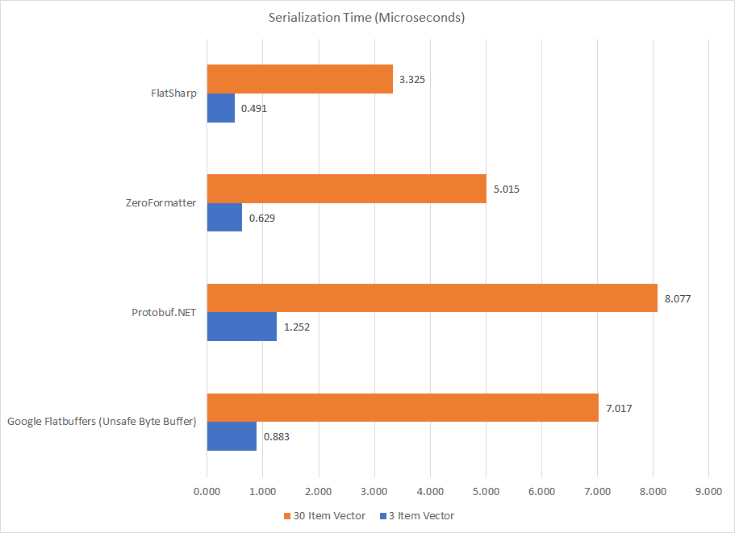
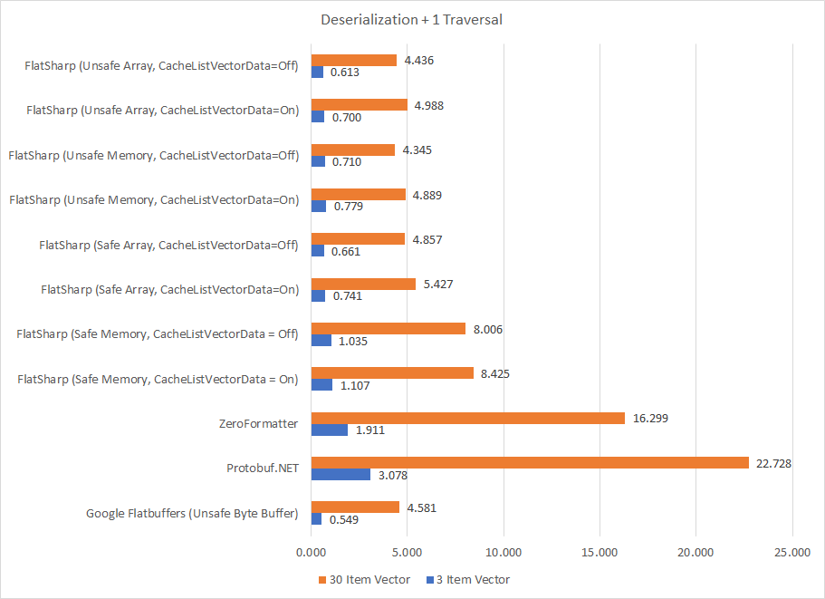
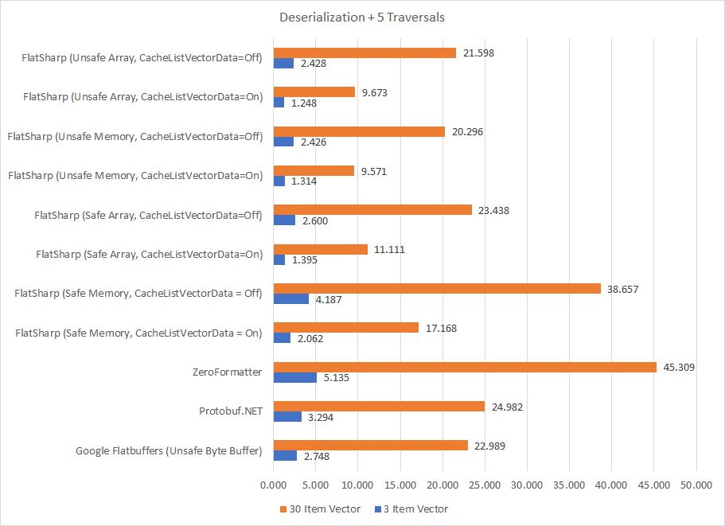

## FlatSharp

FlatSharp is Google's FlatBuffers serialization format implemented in C#, for C#. FlatBuffers is a zero-copy binary serialization format intended for high-performance scenarios. FlatSharp leverages the latest and greatest from .NET in the form of ```Memory<T>``` and ```Span<T>```. As such, FlatSharp's safe-code implementations are often faster than other implementations using unsafe code. FlatSharp aims to provide 3 core priorities:
- Full safety (no unsafe code or IL generation -- more on that below).
- Speed
- FlatBuffers schema correctness

### Current Status
FlatSharp is a very new project and is in active development. There are no known uses in production environments at this time. The current code can be considered alpha quality, with new features still being added. Contributions and proposals are always welcomed. Currently, FlatSharp supports the following FlatBuffers features:
- Structs
- Tables
- Scalars / Strings
- ```IList<T>```, ```IReadOnlyList<T>```, and ```T[]``` Vectors of Strings, Tables, Structs, and Scalars
- ```Memory<T>```/```ReadOnlyMemory<T>``` Vectors of scalars when on little-endian systems (1-byte scalars are allowed in Memory vectors on big-endian systems)
- Discriminated/tagged unions of structs, tables, and strings.

What's not supported (and why):
- Enums. Enums are not currently supported for schema-compatibility reasons; it's too easy to make an implicit change to the type of an enum (going from ```MyEnum : byte``` -> ```MyEnum : int```), which results in a very non-obvious FlatBuffer binary break, since the enum is defined independently of the contract.
- Vectors of Unions. This is a reasonably complex feature that can be approximated with a vector of tables, where each table element contains a union.

### License
FlatSharp is a C# implementation of Google's FlatBuffer binary format, which is licensed under the Apache 2.0 License. Accordingly, FlatSharp is also licensed under Apache 2.0. FlatSharp incorporates code from the Google FlatSharp library for testing and benchmarking purposes.

### Packages
FlatSharp's alpha package is published on nuget.org under the "FlatSharp" package. The unsafe library is published as FlatSharp.Unsafe.

### Getting Started
FlatSharp uses C# as its schema, and does not require any additional files or build-time code generation. Like many other serializers, the process is to annotate your data contracts with attributes, and you're on your way.

#### Defining a Contract

```C#
[FlatBufferTable]
public class MonsterTable
{
    [FlatBufferItem(0)]
    public virtual Position Position { get; set; }
    
    [FlatBufferItem(1)]
    [DefaultValue((short)150)]
    public virtual short Mana { get; set; }
    
    [FlatBufferItem(2)]
    [DefaultValue((short)100)]
    public virtual short HP { get; set; }
    
    [FlatBufferItem(3)]
    public virtual string Name { get; set; }
    
    [FlatBufferItem(4, Deprecated = true)]
    public virtual bool Friendly { get; set; }
    
    [FlatBufferItem(5)]
    public virtual ReadOnlyMemory<byte> Inventory { get; set; }
    
    [FlatBufferItem(6)]
    public virtual FlatBufferUnion<string, Position> DiscriminatedUnion { get; set; }
    
    // Note that that the next index starts at 8. Unions are 'double-wide' types, so the previous
    // element occupies indices 6 and 7!
    
    [FlatBufferItem(8)]
    [DefaultValue((int)Color.Blue)]
    public virtual int RawColor { get; set; }
    
    // Expressing enums still possible.
    public Color Color
    {
      get => (Color)this.RawColor;
      set => this.RawColor = (int)value;
    }
}

[FlatBufferStruct]
public class Position
{
   [FlatBufferItem(0)]
   public virtual float X { get; set; }
   
   [FlatBufferItem(1)]
   public virtual float Y { get; set; }
   
   [FlatBufferItem(2)]
   public virtual float Z { get; set; }
}
```
For FlatSharp to be able to work with your schema, it must obey the following set of contraints:
- All types must be public and externally visible
- All types must be unsealed.
- All properties decorated by ```[FlatSharpItem]``` must be virtual and public. Setters may be omitted, but Getters are required.
- All FlatSharpItem indexes must be unique within the given data type.
- Struct/Table vectors must be defined as ```IList<T>```, ```IReadOnlyList<T>```, or ```T[]```.
- Scalar vectors must be defined as either ```IList<T>```, ```IReadOnlyList<T>```, ```Memory<T>```, ```ReadOnlyMemory<T>```, or ```T[]```.
- All types must be serializable in FlatBuffers (that is -- you can't throw in an arbitrary C# type).

When versioning your schema, the [FlatBuffer rules apply](https://google.github.io/flatbuffers/flatbuffers_guide_writing_schema.html).

#### Serializing and Deserializing
```C#
public void ReadMonsterMemory(Memory<byte> monsterBuffer)
{
  MonsterTable monster = FlatBufferSerializer.Default.Parse<MonsterTable>(new MemoryInputBuffer(monsterBuffer));
  Console.WriteLine($"{monster.Position.X}, {monster.Position.Y}, {monster.Position.Z}");
}

public void ReadMonsterArray(byte[] monsterBuffer)
{
  MonsterTable monster = FlatBufferSerializer.Default.Parse<MonsterTable>(new ArrayInputBuffer(monsterBuffer));
  Console.WriteLine($"{monster.Position.X}, {monster.Position.Y}, {monster.Position.Z}");
}

public void WriteMonster(MonsterTable monster)
{
  // FlatSharp does not allocate memory for you when serializing. You may get a BufferTooSmall exception
  // in cases where the supplied buffer was not long enough to hold the data. The recommendation is to
  // pool serialization buffers in a way that makes sense for you.
  byte[] monsterBytes = new byte[10 * 1024];
  FlatBufferSerializer.Default.Serialize(monster, buffer.AsSpan());
}

public int GetBufferSize(MonsterTable monster)
{
  // Get the maximum number of bytes it will take to serialize this monster instance:
  return FlatBufferSerializer.Default.GetMaxSize(monster);
}
```

### Internals
FlatSharp works by generating dynamic subclasses of your data contracts based on the schema that you define, which is why they must be public and virtual. That is, when you attempt to deserialize a ```MonsterTable``` object, you actually get back a dynamic subclass of ```MonsterTable```, which has properties defined in such a way as to index into the buffer. When a FlatSharp object reads a value for it, it goes ahead and makes a copy of that value so that it does not need to consult the original buffer again.


### Safety
FlatSharp is a lazy parser. That is -- data from the underlying buffer is not actually parsed until you request it. This keeps things very lean throughout your application and prevents your application from paying a deserialize tax on items that you will not use. However, this is a double-edged sword, and any changes to the underlying buffer will modify, and possibly corrupt, the state of any objects that reference that buffer.

```C#
public void ReadMonster(byte[] monsterBuffer)
{
  MonsterTable monster = FlatBufferSerializer.Default.Parse<MonsterTable>(monsterBuffer);
  monsterBuffer[7] = 123;
  
  // This data is no longer valid, and using the Monster object results in undefined behavior.
  Console.WriteLine($"{monster.Position.X}, {monster.Position.Y}, {monster.Position.Z}");
}
```
Therefore, to use FlatSharp effectively, you must do so with buffer lifecycle management in mind. The simplest way to accomplish is to just let the GC take care of it for you. However, in scenarios where buffers are pooled, lifecycle management becomes important.

### Security
Serializers are a common vector for security issues. FlatSharp takes the following approach to security:
- All core operations are overflow-checked
- No unsafe code or IL generation via IL.Emit (with the exception of the Unsafe package)
- Use standard .NET libraries for reading and writing from memory (with the exception of the Unsafe package)

FlatSharp manages to acheive performance by generating safe C# code at runtime and pushing that through the Roslyn C# compiler to emit and load a runtime assembly. This provides an additional level of safety over generating IL directly with minimimal performance impact, since we compile without allowing unsafe code and can embed other invariants in the code (such as readonly). Further, it is easier to debug generated C# than generated IL. Roslyn does have a 3 to 4 second first-run penalty, but subsequent invocations are very quick, and "compilation" is only done once per root-level FlatBuffer object.

In its default configuration, the FlatSharp library uses no unsafe code at all, and only uses overflow-checked operators. FlatSharp does come with an unsafe companion library that can meaningfully improve performance in some scenarios (```UnsafeMemoryInputBuffer``` provides roughly double the performance of ```MemoryInputBuffer``` with the caveat that it must be disposed for performance to be acceptable).

### Performance & Benchmarks
FlatSharp is really fast. This is primarily thanks to new changes in C# with Memory and Span, as well as FlatBuffers itself exposing a very simple type system that makes optimization simple. FlatSharp has a default serializer instance (```FlatBuffersSerializer.Default```), however it is possible to tune the serializer by creating your own with a custom ```FlatBufferSerializerOptions``` instance. Right now, the only option is ```CacheListVectorData```, which instructs FlatSharp to generate List Vector deserializers that progressively caches data as it is read. This costs an additional array allocation, and is slower in the case when each element is accessed only once. However, when each element is accessed multiple times, this is a useful optimization.

The FlatSharp benchmarks were run on .NET Core 2.1, using a C# approximation of [Google's FlatBuffer benchmark](https://github.com/google/flatbuffers/tree/benchmarks/benchmarks/cpp/FB). The FlatSharp benchmarks use this schema, but with the following parameters:
- Vector length = 3 or 30
- Traversal count = 1 or 5

The benchmarks test 4 different serialization frameworks:
- FlatSharp (of course :))
- Protobuf.NET
- Google's C# Flatbuffers implementation
- ZeroFormatter

#### Serialization


#### Deserialization + 1 Traversal of Data


#### Deserialization + 5 Traversals of Data


### Roadmap
- Support for property setters and mutable types.
- Security hardening and fuzzing
- Code gen based on FBS schema files
- GRPC support
