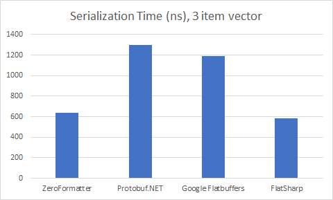
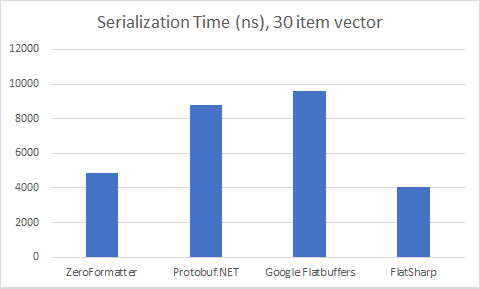
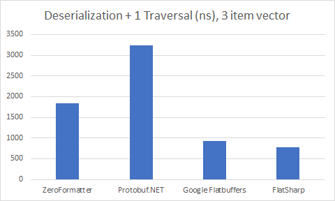
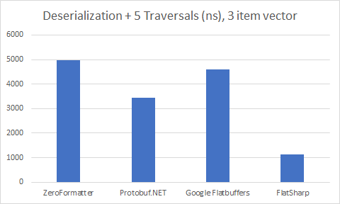
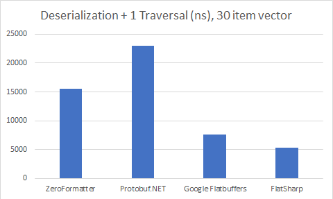
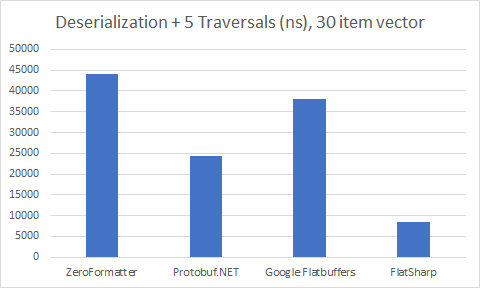

## FlatSharp
FlatSharp is Google's FlatBuffers serialization format implemented in C#, for C#. FlatBuffers is a zero-copy binary serialization format intended for high-performance scenarios. FlatSharp leverages the latest and greatest from .NET in the form of ```Memory<T>``` and ```Span<T>```. As such, FlatSharp's safe-code implementations are often faster than other implementations using unsafe code. FlatSharp aims to provide 3 core priorities:
- Full safety (no unsafe code or IL generation -- more on that below).
- Speed
- FlatBuffers schema correctness
- Compatibility with other C#-focused projects like Unity, Blazor, and Xamarin. If it supports .NET standard 2.0, it supports FlatSharp.

All FlatSharp packages are published on nuget.org:
- **FlatSharp.Runtime**: The runtime library. You always need this.
- **FlatSharp**: Support for runtime schemas with C# attributes. Includes ```FlatBufferSerializer```.
- **FlatSharp.Unsafe**: Unsafe I/O extensions.
- **FlatSharp.Compiler**: Build time compiler for generating C# from an FBS schema.

### Getting Started
If you're completely new to FlatBuffers, take a minute to look over [the FlatBuffer overview](https://google.github.io/flatbuffers/index.html#flatbuffers_overview). Additionally, it's worth the time to understand the different elements of [FlatBuffer schemas](https://google.github.io/flatbuffers/flatbuffers_guide_writing_schema.html).

#### 1. Define a schema
There are two ways to define a FlatBuffer schema with FlatSharp. The first is to use [C# attributes to annotate classes](samples/Example0-AttributeBasedSchemas/MonsterAttributeExample.cs), like you would with other serializers:
```c#
// FlatSharp supports enums, but makes you promise not to change the underlying type.
[FlatBufferEnum(typeof(byte))]
public enum Color : byte { Red = 1, Green, Blue }

// Tables are flexible objects meant to allow schema changes. Numeric properties can have default values,
// and all properties can be deprecated. Each index may only be used once, so once the "Parent" property is
// deprecated, index 2 cannot be used again by a different property.
[FlatBufferTable]
public class Person : object
{   
    [FlatBufferItem(0)] public virtual int Id { get; set; }
    [FlatBufferItem(1)] public virtual string Name { get; set; }
    [FlatBufferItem(2, Deprecated = true)] public virtual Person Parent { get; set; }
    [FlatBufferItem(3)] public virtual IList<Person> Children { get; set; }
    [FlatBufferItem(4, DefaultValue = Color.Blue)] public virtual Color FavoriteColor { get; set; } = Color.Blue;
    [FlatBufferItem(5)] public virtual Location Position { get; set; }
}

// Structs are really fast, but may only contain scalars and other structs. Structs
// cannot be versioned, so use only when you're sure the schema won't change.
[FlatBufferStruct]
public class Location : object
{
    [FlatBufferItem(0)] public virtual float Latitude { get; set; }
    [FlatBufferItem(1)] public virtual float Longitude { get; set; }
}
```

The second way to define a schema is to use an [FBS schema file](samples/Example2-SchemaFiles/SchemaFilesExample.fbs) and run the FlatSharp compiler at build-time with your project. This enables fancy options like precompiling your serializers, interop with FlatBuffers in other languages, and GRPC definitions.
``` fbs
namespace MyNamespace;

enum Color : ubyte { Red = 1, Green, Blue }

table Person (PrecompiledSerializer) {
    Id:int;
    Name:string;
    Parent:Person (deprecated);
    Children:[Person];
    FavoriteColor:Color = Blue;
    Position:Location;
}

struct Location {
    Latitude:float;
    Longitude:float;
}

rpc_service PersonService {
    GetParent(Person):Person;
}
```

#### 2. Serialize your data
Serialization is easy!
```c#
Person person = new Person(...);
int maxBytesNeeded = FlatBufferSerializer.Default.GetMaxBytes(person);
byte[] buffer = new byte[maxBytesNeeded];
int bytesWritten = FlatBufferSerializer.Default.Serialize(person, buffer);
```

#### 3. Parse your data
Deserializing is easier!
```c#
// By default, FlatSharp deserializes greedily, so everything in the Person is read from the data buffer
// and copied into the Person object, and the data buffer is no longer used after the Parse method returns.
// However, FlatSharp supports a variety of Lazy modes that read data from the buffer on demand and are
// often faster. These are covered under advanced topics below.
Person p = FlatBufferSerializer.Default.Parse<Person>(data);
```

#### Samples & Advanced Topics
FlatSharp supports some interesting features not covered here. Please visit the [samples solution](samples/) to see examples of:
- [Build-time serializer code generation](samples/Example3-SchemaFiles2/)
- [Deserialization options (Lazy, Greedy, and everything in between)](samples/Example1-SerializerOptions/SerializerOptionsExample.cs)
- [IO Options](samples/Example4-IOOptions/)
- [gRPC](samples/Example5-gRPC/)
- [Copy Constructors](samples/Example6-CopyConstructors/)
- [FBS Includes](samples/Example7-Includes/)
- [Sorted Vectors](samples/Example8-SortedVectors/)

### Internals
FlatSharp works by generating subclasses of your data contracts based on the schema that you define. That is, when you attempt to deserialize a ```MonsterTable``` object, you actually get back a subclass of ```MonsterTable```, which has properties defined in such a way as to index into the buffer, according to the deserialization mode specified (greedy, lazy, etc).

### Security
Serializers are a common vector for security issues. FlatSharp takes the following approach to security:
- All core operations are overflow-checked
- No unsafe code (with the exception of the Unsafe package)
- No IL generation
- Use standard .NET libraries for reading and writing from memory

At its core, FlatSharp is a tool to convert a FlatBuffer schema into a pile of safe C# code that depends only upon standard .NET libraries. There is no "secret sauce". Buffer overflows are intended to be impossible by design, due to the features of .NET and the CLR. A malicious input may lead to corrupt data or an Exception being thrown, but the process will not be compromised. As always, a best practice is to encrypt data at rest, in transit, and decorate it with some checksums.

### Performance & Benchmarks
FlatSharp is really fast. This is primarily thanks to new changes in C# with Memory and Span, as well as FlatBuffers itself exposing a very simple type system that makes optimization simple. FlatSharp has a default serializer instance (```FlatBuffersSerializer.Default```), however it is possible to tune the serializer by creating your own with a custom ```FlatBufferSerializerOptions``` instance. More details are available in the [samples solution](samples/Example1-SerializerOptions/SerializerOptionsExample.cs).

The FlatSharp benchmarks were run on .NET Core 2.1, using a C# approximation of [Google's FlatBuffer benchmark](https://github.com/google/flatbuffers/tree/benchmarks/benchmarks/cpp/FB), which can be found [here](src/Benchmark).The FlatSharp benchmarks use this schema, but with the following parameters:
- Vector length = 3 or 30
- Traversal count = 1 or 5

The full results for each version of FlatSharp can be viewed in the [benchmarks folder](benchmarks).

The benchmarks test 4 different serialization frameworks:
- FlatSharp
- Protobuf.NET
- Google's C# Flatbuffers implementation
- ZeroFormatter

#### Serialization
 | 
----------------------|-----------------------

#### Deserialization
 | 
------------------------|-------------------------
|

### Roadmap
- [ ] Security hardening and fuzzing
- [x] Code gen based on FBS schema files
- [x] Build time generation of Serializers
- [x] GRPC support

### License
FlatSharp is a C# implementation of Google's FlatBuffer binary format, which is licensed under the Apache 2.0 License. Accordingly, FlatSharp is also licensed under Apache 2.0. FlatSharp incorporates code from the Google FlatSharp library for testing and benchmarking purposes.
